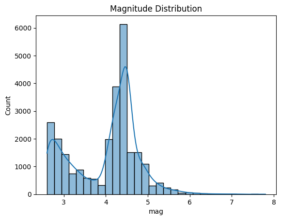
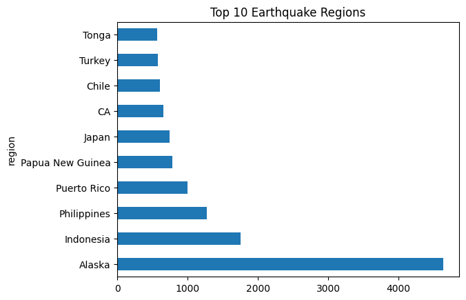
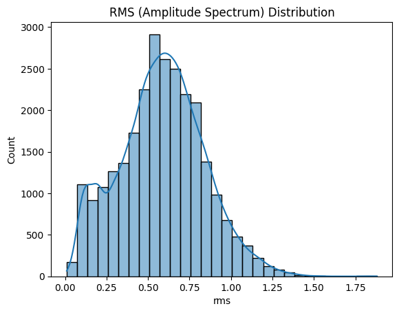
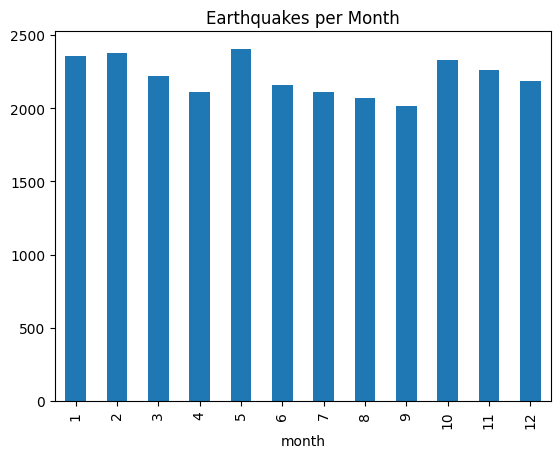
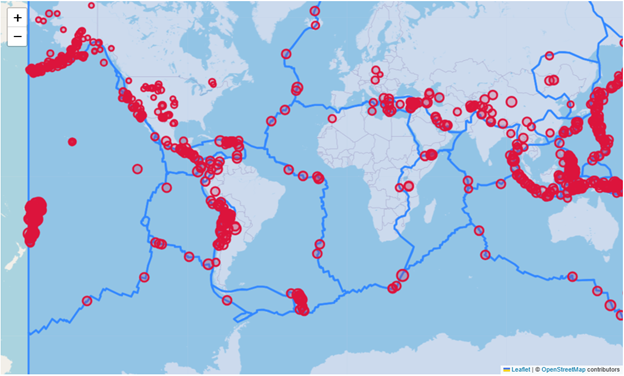

# Global Earthquake Analysis – 2023

This project presents a detailed data analysis of global earthquake activity for the year 2023 using data sourced from Kaggle. The analysis explores patterns in earthquake magnitude, depth, time distribution, geography, and alignment with tectonic plates, using both static and interactive visualizations.

---

## Dataset

- Source: [Earthquakes 2023 Global – Kaggle](https://www.kaggle.com/datasets/mustafakeser4/earthquakes-2023-global)
- File: `earthquakes_2023_global.csv`

### Column Descriptions

| Column Name         | Description                                                                 |
|---------------------|-----------------------------------------------------------------------------|
| `Time`              | Timestamp of the earthquake event                                           |
| `Latitude`          | Latitude (north-south position) of the epicenter                           |
| `Longitude`         | Longitude (east-west position) of the epicenter                            |
| `Depth`             | Depth of the earthquake in kilometers                                       |
| `Mag`               | Magnitude of the earthquake                                                 |
| `MagType`           | Type of magnitude measurement (e.g., ML, MB)                               |
| `Nst`               | Number of seismic stations that reported the earthquake                    |
| `Gap`               | Coverage gap between seismic stations (in degrees)                         |
| `Dmin`              | Minimum distance to the epicenter from a reporting station                 |
| `Rms`               | Root Mean Square of the amplitude spectrum                                  |
| `Net`               | Network identifier for the source of the event                             |
| `Id`                | Unique identifier for the earthquake event                                 |
| `Updated`           | Last updated timestamp of the event info                                   |
| `Place`             | Human-readable location description of the earthquake                      |
| `Type`              | Type of seismic event (usually "earthquake")                               |
| `HorizontalError`   | Horizontal error margin in location determination                          |
| `DepthError`        | Estimated error in the depth measurement                                   |
| `MagError`          | Estimated error in the magnitude measurement                               |
| `MagNst`            | Number of stations used to calculate the magnitude                         |
| `Status`            | Status of the event (e.g., reviewed or automatic)                          |
| `LocationSource`    | Source that reported the earthquake's location                             |
| `MagSource`         | Source that reported the earthquake's magnitude                            |

---

## Technologies Used

- Python (Jupyter Notebook)
- Pandas, NumPy
- Matplotlib, Seaborn
- Folium (for interactive maps)
- GeoPandas (to overlay tectonic plates)

---

## Visualizations & Analysis

### 1. Magnitude Distribution
Histogram and KDE plot showing the frequency of different earthquake magnitudes.
- Insight: Most earthquakes in 2023 were Minor to Light.
  

---

### 2. Top 10 Earthquake Regions
Horizontal bar chart identifying the most seismically active regions.
- Insight: Alaska, Indonesia, and the Philippines were among the most active.

---

### 3. Seismic Event Types (Pie Chart)
Pie chart showing the proportion of events by magnitude category.
- Insight: Most events were in the Minor to Light range.

---

### 4. RMS Amplitude Spectrum Distribution
Histogram showing the spread of earthquake signal strength (RMS).
- Insight: Most earthquakes had low to moderate RMS values.

---

### 5. Earthquakes per Month
Bar chart showing number of earthquakes per month in 2023.
- Insight: Earthquakes occurred consistently, with small peaks in certain months.

---

### 6. Earthquakes + Tectonic Plates Map (Interactive)
Interactive Folium map visualizing epicenters alongside tectonic plate boundaries.
- Insight: Most earthquakes align along tectonic plate boundaries.

File: `seismic_map_with_plates.html`  

---

## Conclusions

- Earthquake activity in 2023 was dominated by low to moderate magnitude events.
- Tectonic boundaries strongly influence earthquake locations.
- Alaska, Indonesia, and nearby regions are global seismic hotspots.

---

## Repository Contents

| File                          | Description                                  |
|-------------------------------|----------------------------------------------|
| `Earthquake Analysis.ipynb`   | Main Jupyter notebook with all analysis      |
| `earthquakes_2023_global.csv` | Earthquake dataset for 2023                  |
| `PB2002_plates.json`          | GeoJSON file with tectonic plate data        |
| `seismic_map_with_plates.html`| Interactive map with quakes + plates         |
| `README.md`                   | Project documentation (this file)            |
| `requirements.txt`            | List of dependencies for the environment     |

---

## Author

**Sanjana Marri**  
GitHub: [@sanjanamarri2521](https://github.com/sanjanamarri2521)

---

## License

This project is open source under the MIT License.
